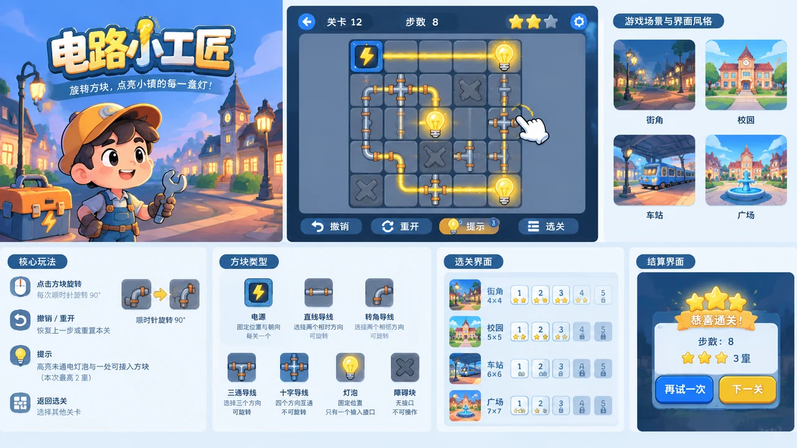

# Circuit Craftsman Game Design Document

## 1. Game Overview

Circuit Craftsman is an original casual puzzle game designed for browser minigame portals such as 4399. Players rotate circuit tiles to connect a power source to every bulb and restore the town's lighting.

- **Genre**: Level-based puzzle game.
- **Target audience**: Casual players who enjoy short thinking sessions and progressing through levels.
- **Platforms**: Desktop web browsers, with support for mobile touchscreens.
- **Session length**: Approximately 1–3 minutes per level and 60–90 minutes for the full game.
- **Core appeal**: Read circuit paths, plan connections, and enjoy immediate feedback as all the lights turn on.

## 2. Theme and Objective

A storm has damaged circuits across the town. Players take the role of a repair apprentice and restore lighting in the street, school, station, and square in sequence.

The objective of each level is to power every designated bulb at the same time. There is no failure countdown; players can keep adjusting the circuit until they find a solution.

## 3. Core Gameplay

### 3.1 Controls

- Left-click a tile to rotate it 90° clockwise.
- Tap a tile on a touchscreen to perform the same action.
- Provide Undo, Restart, Hint, and Level Select buttons. Undo restores the previous rotation.
- Power sources, bulbs, and obstacle tiles cannot rotate. Borders and hover effects distinguish interactive tiles.

### 3.2 Circuit Rules

The board uses a grid with four cardinal directions. Adjacent tiles connect only when their ports face each other; diagonal tiles cannot connect.

Power travels from the source through connected wires. A bulb lights up when it connects to the source, and the level is complete when every target bulb is lit. Open ports do not cause failure, closed loops incur no penalty, and not every wire needs to carry power.

### 3.3 Tile Types

| Type | Rules |
| --- | --- |
| Power source | Fixed position and orientation; one per level, providing the starting point for power |
| Straight wire | Connects two opposite directions; rotatable |
| Elbow wire | Connects two adjacent directions; rotatable |
| T-junction wire | Connects three directions for branching power; rotatable |
| Cross wire | Connects all four directions; not rotatable |
| Bulb | Fixed position with a single input port |
| Obstacle | No ports; not interactive |

## 4. Level Design

The initial release contains 40 handcrafted levels across four regions, with 10 levels in each region.

| Region | Board Size | Design Focus |
| --- | --- | --- |
| Street | 4×4 | Learn rotation, matching ports, and connecting a single bulb |
| Campus | 5×5 | Introduce T-junctions and multiple bulbs; learn branching power |
| Station | 6×6 | Introduce obstacles and distracting wires; increase route-planning difficulty |
| Square | 7×7 | Combine multiple branches, detours, and local loops |

The first three levels teach controls through tile highlights and click animations rather than lengthy explanations. Each level has at least one predefined valid solution, after which rotatable tiles are scrambled; the initial board must not already be complete. Levels with multiple solutions are judged by their actual powered state, without requiring a match to the predefined answer.

## 5. Scoring and Progression

Each valid rotation counts as one move. Undo does not reduce the accumulated move count, while Restart resets the current attempt's count to zero. Each level defines and verifies a reference move count S: completing the level earns one star, using no more than ⌈1.5S⌉ moves earns two stars, and using no more than S moves earns three stars.

A hint highlights one unpowered bulb and a tile that can help connect it to the source; it does not rotate the tile automatically. Using a hint caps the current attempt at two stars. Hints derive from a valid solution for the current board and must not incorrectly reject an alternative valid solution.

Completing a level unlocks the next one and preserves the highest star rating earned. Stars unlock bulb appearances without affecting level difficulty or circuit rules.

## 6. Interface and Presentation

- **Level selection**: Show the four regions, level numbers, unlock status, and best star ratings.
- **Game screen**: Show the level and move count at the top, the board in the center, and action buttons at the bottom.
- **Results screen**: Show the current attempt's stars and move count, with Next Level and Try Again buttons.
- **Visual style**: Bright 2D cartoon art, with a light gray board and dark wires. Powered wires display moving yellow light particles and bulbs glow together; state changes must not rely on color alone.
- **Audio feedback**: Use a soft mechanical sound for rotation, a short tone when a bulb lights up, and a brief melody for level completion. Support muting.

## 7. Technology and Saves

Implement the game with HTML5 Canvas or Phaser. Level data records board dimensions, tile types, initial orientations, and reference move counts. After each rotation, traverse the graph from the power source to update wire and bulb states; real-world circuit physics simulation is unnecessary.

Use browser local storage to save unlocked progress, best star ratings, appearances, and mute settings without requiring a login. Scale the board proportionally to the available space. On mobile, aim for touch targets of at least 44×44 CSS pixels and reduce outer margins when space is limited.

## 8. Acceptance Criteria

Verify that every level is solvable and that powered states remain consistent after rotation, Undo, Restart, and Hint actions. Trigger the results screen only once when multiple bulbs light up together, and disable board interaction while results are shown.

Restore progress after a page refresh, and fall back to default progress when save data is missing or corrupt. Verify on desktop and mobile that the board remains unobscured, buttons remain clickable, and browser restrictions on audio before user interaction do not prevent gameplay. The first release excludes advertising, paid items, and online leaderboards.

