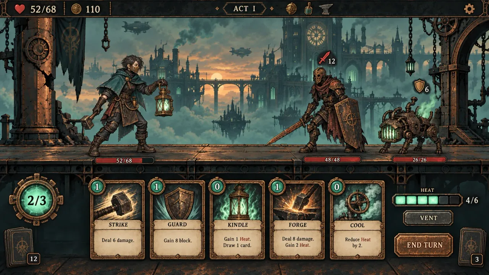

# Ember Route · Game Design Document

> Version: 0.1 / Game design and visual preproduction\
> Genre: Single-player, turn-based roguelike deckbuilder\
> Platform: Browser; desktop first, with tablet and mobile support\
> Deliverables at this design stage: Gameplay design, UI mockups, and character/environment concept art; a runnable game had not yet been implemented.

## 1. Product Concept

An industrial city in the sky is going dark, one level at a time. The player is the last lantern blacksmith, using cards to drive a portable furnace, choosing routes between floating islands and iron bridges, collecting lost furnace sigils, and defeating the Clocktower Regent who controls the central furnace core.

The experience in one sentence: **Read the enemy's next move, choose between attacking, building heat, and venting, and rekindle a dead city with an ever-changing deck.**

The target audience enjoys predictable turn-based combat, route planning, synergies, and short runs with quick restarts. The design takes inspiration from *Slay the Spire*'s enemy intents, branching routes, and post-battle deckbuilding rhythm, while using an original world, characters, artwork, and Heat rules.

### Design Pillars

1. **Information before action:** Enemy intents are always visible. Before a card is played, show damage, Block, Heat, and any potential Overheat.
2. **Heat is a second tactical axis:** Energy limits actions within a turn; Heat connects turns. High heat is an opportunity, but also a debt paid in health.
3. **Choices have costs:** Rewards can be skipped, upgrading and healing are mutually exclusive, and elites offer relics at the cost of health.
4. **A small set of clear synergies:** The first version has one character, with three build directions based on burning attacks, venting, and retaining cards.

## 2. World and Character

### Hero: Lan, the Lantern Blacksmith

A short cloak, dark teal workwear, and an aged copper half mask, with a square lantern containing mint-green furnace fire at the waist. The main hand holds a short forge hammer; the other controls the lantern valve. The silhouette is compact. The hero normally stands on the left of the battlefield, facing right.

Starting resources: 68 HP, 3 Energy, 0 Heat, and 80 gold. Starting relic, **Old Furnace Core**: The first active Vent in each battle grants 2 extra Block.

### Chapter Plan

| Chapter | Location | Visuals | Gameplay Theme | Boss |
| --- | --- | --- | --- | --- |
| I | Ash Harbor Foundry Bridge | Patinated copper bridges, abandoned kilns, a distant floating city | Teach Heat and intents; direct damage | Iron Bell Overseer |
| II | Mirror-Mist Conservatory | Broken glass, cold white steam, mechanical plants | Multiple targets, status cards, Retain | Conservatory Weaver |
| III | Skybound Clocktower | Huge gears, mint-green furnace core, black-and-gold altar | Resource pressure and synergy tests | Clocktower Regent |

The first playable version contains only Chapter I. All three chapters are future expansion work, outside first-release acceptance.

## 3. Run Structure and Routes

### Core Loop

Starting furnace-sigil choice → Route node → Turn-based battle → Choose one of three card rewards or skip → Continue the route → Rest or trade → Boss → Victory results or defeat and restart.

### Chapter I Scope

A run lasts approximately 20–30 minutes and has 12 floors, with up to 3 nodes per floor. Departure is floor 0, the boss is fixed on floor 12, and floor 11 is always a Rest. Progress moves from bottom to top. Only next-floor nodes directly connected to the current node may be selected.

- Floor 1 is always a normal battle for onboarding.
- Floors 2–10 contain normal battles, events, elites, shops, rests, and chests.
- Floor 6 is always a chest. Every complete route must contain at least one Rest and one Shop.
- Elites first appear on floor 4, cannot appear on consecutive floors, and are limited to 2 per route.
- Connections run between adjacent columns without crossings that obscure reachability. Traveled routes use copper-gold lines; available nodes have a mint-green outer ring.
- After generation, verify that every node is reachable from departure and can reach the boss. Otherwise, regenerate that section.

### Node Rewards

Normal battle: 15–25 gold and one of three cards, with a skip option. Elite: 35–45 gold, one of three cards, and one relic. Chest: One relic. Boss: Results and Chapter I victory; the three-chapter version additionally offers one of three furnace sigils.

On death, the run's deck, gold, and relics are cleared. Keep compendium discoveries, completed chapters, and settings, without permanent stat boosts.

## 4. Combat Rules and Resolution Order

### Basic Resources

- Restore Energy to 3 each turn. Unused Energy does not carry over unless a card explicitly says otherwise.
- Draw 5 cards at the start. The hand limit is 10; excess draws go directly to discard with a notification.
- If the draw pile is empty and another draw is needed, shuffle the discard pile into a new draw pile. Exhausted cards are stored separately and never shuffled back.
- Ordinary cards in hand are discarded at turn end. Cards with **Retain** stay in hand but gain no extra effect automatically.
- Block absorbs normal damage. Clear the player's Block at the start of their next turn, and an enemy's Block at the start of its own turn.
- Player HP reaching zero causes immediate defeat. The last enemy reaching zero causes immediate victory, canceling queued actions and the Overheat check.

### Heat and Vent

Heat ranges from 0–6 and starts at 0 each battle. Card-generated Heat is capped at 6; excess is not accumulated. At the start of each player turn, naturally cool by 1, to a minimum of 0. The first turn still starts at 0.

**Active Vent:** Once per turn, available only with at least 2 Heat. Spend 2 Heat to gain 4 Block, without spending Energy. This is a persistent action button, not a card. Show remaining uses, Block gained, and the cooling preview.

**Overheat:** After the player selects End Turn, if Heat is 6, first lose 4 HP, ignoring Block, then set Heat to 2. Enemies act afterward in sequence. If Overheat reduces HP to zero, immediately lose. Heat 5 does not cause Overheat.

**High heat:** A conditional state at Heat 4 or above. It empowers only cards that explicitly list a high-heat effect; there is no global attack bonus. Card resolution: Pay Energy → Evaluate conditions using Heat before resolution → Apply the text effects → Generate Heat → Move the card to discard or exhaust. Refresh previews immediately after every value change.

### Turn Order

1. Start of player turn: Clear Block, naturally cool, restore Energy, reset Vent uses, resolve turn-start relics and powers, then draw 5 cards.
2. Player actions: Play cards and Vent; draw, discard, and exhaust piles can be inspected. Targeted cards pay resources only after a target is chosen.
3. End turn: Resolve turn-end effects in acquisition order, discard non-retained cards, then check Overheat.
4. Enemies act from left to right. Normal damage consumes Block before HP. Check victory and defeat after every enemy action.
5. Resolve damage-over-time and reduce timed statuses; update enemy intents for the next round, then return to step 1.

### Key Statuses

| Status | Rule |
| --- | --- |
| Burn | At the target's turn end, take normal damage equal to the stacks, which Block can absorb, then lose 1 stack; stacks accumulate |
| Weak | Attack damage ×0.75, rounded down; stacks are remaining action turns |
| Vulnerable | Incoming attack damage ×1.5, rounded down; stacks are remaining action turns |
| Strength | Add this amount to each attack hit for the rest of the battle |
| Retain | Do not automatically discard this card at the end of this turn |
| Exhaust | Remove the card from the battle's card cycle after use |

Attack damage is calculated as **Base damage + Strength → Weak → Vulnerable → Block**. Burn is not an attack and is unaffected by Strength, Weak, or Vulnerable. Timed statuses applied to the player by enemies lose a stack after the player's action phase; those applied to enemies by the player lose a stack after the corresponding enemy's action phase. This prevents a newly received status from expiring immediately.

### Example Turn

Current Heat: 3. Energy: 3. Enemy intent: Attack for 12. Play **Kindle**: Energy stays at 3, Heat becomes 5, and draw 1. Play **Forge Hammer**: Spend 1 Energy, deal 13 damage at high heat, and Heat stays at 5. Play **Guard**: 1 Energy remains and gain 6 Block. Vent: Heat falls to 3 and Block rises to 10, or 12 if this is the first Vent of the battle with Old Furnace Core. Ending the turn does not Overheat. The player trades Heat for defense while retaining decision space around unused Energy.

## 5. Cards and Builds

The first version has 24 obtainable cards plus 2 non-obtainable status cards. The starting deck has 10 cards: Strike ×4, Guard ×4, Kindle ×1, Forge Hammer ×1. Base rarity weights are 70%/25%/5% for Common/Uncommon/Rare; elite rewards use 45%/40%/15%. Each reward offers three different cards, which may duplicate cards already owned. These numbers are initial tuning values.

### Card Table

The Upgrade column lists all value changes after upgrading at a Rest; unspecified properties are unchanged. A card can be upgraded once.

| ID | Name | Rarity / Type | Cost | Effect | Upgrade |
| --- | --- | --- | --- | --- | --- |
| C01 | Strike | Common / Attack | 1 | Deal 6 damage | 9 damage |
| C02 | Guard | Common / Skill | 1 | Gain 6 Block | 9 Block |
| C03 | Kindle | Common / Skill | 0 | Heat +2; draw 1 card | Draw 2 cards |
| C04 | Forge Hammer | Common / Attack | 1 | Deal 8 damage; high heat: +5 damage | Base damage 11 |
| C05 | Spark | Common / Attack | 1 | Deal 5 damage, apply 3 Burn, Heat +1 | 7 damage and 4 Burn |
| C06 | Copper Wall | Common / Skill | 1 | Gain 8 Block, Heat +1 | 11 Block |
| C07 | Condense | Common / Skill | 0 | Heat -2, gain 3 Block | 5 Block |
| C08 | Seek Flame | Common / Skill | 1 | Draw 3 cards, Heat +1 | Draw 4 cards |
| C09 | Armor Spike | Common / Attack | 1 | Deal 7 damage, apply 1 Vulnerable | 10 damage and 2 Vulnerable |
| C10 | Steam Veil | Common / Skill | 1 | Apply 1 Weak to all enemies, Heat -1 | 2 Weak |
| C11 | Pressurize | Uncommon / Skill | 1 | Gain 10 Block, Heat +2, Retain | 13 Block |
| C12 | Ember Slash | Uncommon / Attack | 2 | Deal 18 damage; high heat: +10 damage; Heat +2 | Base damage 23 |
| C13 | Triple Forge | Uncommon / Attack | 1 | Deal 3 damage three times, Heat +1 | 4 damage per hit |
| C14 | Tar Flask | Uncommon / Skill | 1 | Apply 4 Burn to all enemies | 6 Burn |
| C15 | Reforge | Uncommon / Skill | 1 | Return 1 non-Reforge card from discard to hand; Exhaust | Cost 0 |
| C16 | Ember Guard | Uncommon / Power | 1 | Each active Vent grants 3 extra Block; leaves the card piles for this battle | 5 extra Block |
| C17 | Cold Cycle | Uncommon / Skill | 1 | Heat -3; if actual cooling is at least 2, draw 2 cards | Cost 0 |
| C18 | Preheat | Uncommon / Power | 1 | Heat +1 at each turn start; leaves the card piles for this battle | Also gain 2 Block |
| C19 | Furnace Pulse | Rare / Attack | 2 | Deal 14 damage to all enemies, Heat +2 | 19 damage |
| C20 | Molten Gold | Rare / Skill | 0 | Heat +3, gain 2 Energy; Exhaust | Gain 3 Energy |
| C21 | Thermal Valve | Rare / Power | 2 | Natural cooling becomes 2; draw 1 card on the first actual cooling each turn; leaves the card piles for this battle | Cost 1 |
| C22 | Memory Sigil | Rare / Power | 1 | At each turn end, choose 1 non-retained card in hand to Retain for that turn; leaves the card piles for this battle | Also add 3 to that card's damage or Block on its next use; remove the bonus afterward |
| C23 | Cold Reprisal | Rare / Attack | 1 | Deal damage equal to current Block, capped at 30; Retain | Cap 40 |
| C24 | Last Flame | Rare / Attack | 3 | Deal 36 damage, set Heat to 6; Exhaust | 45 damage |

**Cinder:** Unplayable; discarded at turn end. **Rust:** Unplayable; Retain; lose 1 HP at turn end. Exhausting it prevents further triggers. Status cards cannot appear as rewards or be upgraded. Shop removal can remove Rust from the out-of-combat deck.

Each Power applies its ability once per use. Multiple copies of the same Power stack. Thermal Valve's natural cooling value does not stack, but the number of draw triggers scales with the number of active copies. An upgraded Memory Sigil's bonus on an individual card affects only the direct damage or Block of that card's main effect on its next use. It does not affect hit count, statuses, Energy, or other values.

### Three Build Directions

- **Burning attacks:** Preheat → High-heat Forge Hammer / Ember Slash → Burn finisher. Strong burst, but risks Overheat and weak defense.
- **Venting:** Copper Wall, Pressurize, Ember Guard, and Thermal Valve link heating and cooling into a Block-and-draw cycle. Damage relies on Cold Reprisal or Burn.
- **Sigils:** Retain Pressurize, Ember Slash, or Cold Reprisal and use Memory Sigil to choose the burst timing. Retaining too much crowds the hand.

The first version does not include infinite loops: Reforge Exhausts and cannot retrieve Reforge; Kindle is free but card supply is finite; there are no infinite reshuffles or repeatable ways to recover exhausted cards.

## 6. Relics, Shops, and Events

### Eight First-Release Relics

| Name | Rule | Visual |
| --- | --- | --- |
| Old Furnace Core | First active Vent each battle grants 2 extra Block; owned at start | Square aged copper furnace core |
| Cracked Ember | First time Heat reaches 4 each battle, gain 1 Energy | Cracked mint-green crystal |
| Condensing Ring | At player turn end, if Heat is 0, gain 4 Block before enemies act | Copper ring with a teardrop gem |
| Smith's Apron | Gain 8 Block on the first turn | Riveted leather apron |
| Bellows Gear | First attack used each battle deals +3 damage on its first hit only | Impeller gear |
| Hollow Coin | Battle gold rewards +10 | Copper coin with a square hole |
| Ash Compass | Heal 3 HP when entering an event | Compass in coal ash |
| Insulated Gloves | First Overheat each battle costs only 1 HP | Thick leather gloves with copper wire |

All first-use triggers need a consumed-state icon and notification, not color alone. The relic pool contains no duplicates, and the starting Old Furnace Core cannot drop again.

### Shop

Always display 3 cards, 1 relic, and 1 removal service. Common cards cost 45, Uncommon 75, Rare 120; relics cost 150. First removal costs 60, permanently increasing by 20 after each use within that run. Generated stock and prices are locked; entering and leaving cannot refresh them. The card section directly shows deck size and the effect of purchasing. Leaving requires no purchase.

### Rest

Choose once: Heal 30% of maximum HP, rounded up (21 at 68 maximum HP), or upgrade 1 unupgraded card. Both cannot be chosen.

### Four First-Release Events

1. **Burning Mailbox:** Pay 8 HP for an Uncommon card, or leave.
2. **Furnace Bargain:** Pay 45 gold to remove a card, or gain 35 gold and add Rust to the deck.
3. **Windward Beacon:** Heal 10 HP, or spend 30 gold to choose one of three Common cards.
4. **Silent Smith:** Upgrade a card for free, but start the first turn of the next battle with only 2 Energy, or leave.

All events show exact costs before confirmation. HP payments must leave at least 1 HP. Otherwise, disable the choice and explain why.

## 7. Enemies and Boss

Enemies have no hidden random move selection; they follow fixed cycles. The first intent is shown immediately. Damage, hit count, Block, and statuses have both icons and text. Multi-hit attacks display **4×2**, not just the total damage.

| Enemy | HP | Cycle | Teaching Purpose |
| --- | --- | --- | --- |
| Rustblade Sentinel | 32 | Attack 8 → Gain 6 Block and attack 4 | Basic intents and breaking Block |
| Soot Whelp | 24 | Apply 1 Weak → Attack 6×2 | Multi-hit attacks and statuses |
| Rogue Lantern | 26 | Add 1 Cinder to the player's discard pile → Attack 7 | Deck pollution |
| Valve Priest | 38 | All enemies gain 6 Block → Attack 9 | Target priority |
| Slag Crawler | 30 | Attack 5 and apply 1 Burn → Attack 10 | Damage over time |
| Copper Guard | 44 | Gain 12 Block → Attack 13 | Attack/defense rhythm |
| Elite: Twinhammer Warden | 86 | Attack 8×2 → Gain 12 Block and 2 Strength → Attack 18 | Burst and defense test |
| Elite: Headless Stoker | 78 | Heat +2 and attack 6 → Add 2 Cinders → Attack 20 | Heat control and draw test |

Floor 1 contains only one Rustblade Sentinel. Floors 2–4 use one enemy or two low-HP enemies. From floor 5 onward, two-enemy combinations can appear, with total base HP no higher than 76. The first version has at most 2 enemies on screen; reserve UI space for 3 in future.

### Boss: Iron Bell Overseer

A huge bell-shaped copper-and-iron shell with hanging chains, a forge hammer, and mint-green light in the furnace mouth. HP: 150. Starting Block: 0.

Fixed cycle: ① Attack 12; ② Gain 16 Block and add 2 Cinders to discard; ③ Attack 8×2. The first time HP falls to 75 or below, enter phase two after the current action finishes. If triggered during the player's turn, preserve the already displayed intent and switch after that enemy action. Gain 2 Strength; the new cycle is Attack 10×2 → Attack 18 and apply 1 Weak → Gain 12 Block and add 1 Cinder. Show a phase-transition notification without rewriting the intent around which the player has already planned.

Victory condition: Defeat the Iron Bell Overseer. Defeat condition: HP reaches zero. Victory/defeat screens show the deck, relics, route, maximum Heat, Overheat count, seed, and a New Journey button.

## 8. Interface and Controls

### Combat Screen

Baseline: 1600×900. A thin top status bar shows HP, gold, chapter, and relics. The central 55% of the screen shows the hero, enemies, intents, and health bars. The bottom approximately 30% contains up to 5 directly readable cards; additional cards are accessed by panning or scrolling.

Bottom-left Energy roundel: **2/3**. On the right, show a six-cell Heat gauge, **4/6**, and an independent Vent button. End Turn is at bottom right. Draw and discard controls sit at the two ends of the hand without covering characters. Indicate high heat using a flame shape and number. At Heat 6, clearly warn: **End Turn: lose 4 HP**.

Hovering lifts and enlarges a card, revealing its full effect and keyword explanations. Targeting uses a connecting line and target outline. Explain invalid targets, insufficient Energy, the hand limit, and unmet Vent conditions. Non-attack cards require a second confirmation after selection to prevent accidental touch activation.

### Route Map

A vertical industrial navigation chart with dashed iron-bridge connections, departure at the bottom, and the boss at the top. Reachable nodes are brightest; others can be inspected but not selected. A compact legend sits on the right. Keep HP, gold, relics, and the deck control at the top. On mobile, allow vertical scrolling and a fixed bottom indicator for the current floor.

### Card Rewards

Up to three equally prominent large cards. A brief heading asks the player to choose one, and each card can expand its keywords. Below them, include a clear Skip button and deck control. Selecting first highlights the card; confirm to collect it without automatically leaving.

### Responsive Design and Accessibility

- Desktop at 1280×720 and above: Single-screen combat. Keep text readable on smaller landscape screens.
- Mobile portrait at 390×844: Resources at the top, battlefield above center, horizontal hand below. Selecting a card opens a local enlarged card and targeting controls. A fixed bottom bar keeps Vent / End Turn available.
- Support mouse selection and card dragging, plus touch taps. Dragging must not be the only way to play.
- Keyboard: 1–0 selects cards, left/right arrows select targets, Enter confirms, Escape cancels. E ends the turn only when no target selection is active.
- Click targets are at least 44×44 CSS pixels. Numbers and effect text contrast with their background.
- Type is not distinguished only by color: Hammer motif for Attack, shield for Skill, furnace sigil for Power. Border patterns also communicate rarity.
- Support reduced motion. Opening a menu pauses combat interaction. Player turns have no time pressure.

## 9. Art and Audio Direction

### Visual Definition

Hand-painted 2D dark industrial fairytale art, with varied etched line weights, cut-paper silhouettes, and localized oil-paint texture. Heroes and enemies have substantial but restrained outer contours; background details have lower contrast than the foreground. Do not copy existing games' characters, logos, card frames, or compositions.

| Use | Color | Description |
| --- | --- | --- |
| Base | #172427 | Deep ink teal-gray |
| Foreground shadows | #25383A | Cold iron gray |
| Primary metal | #B98249 | Aged copper |
| Furnace fire / Selection | #78D6B6 | Mint-green firelight |
| Danger | #D66A50 | Rust red |
| Text / Card stock | #E8DCC0 | Bone-white paper |

Titles use angular serif letterforms; rule text uses a clear Chinese sans-serif in the original design-stage specification. In that specification, final Chinese text was to be typeset by the UI layer. Any text and numbers in generated mockups are visual examples, not final UI glyph assets. Later English UI and font changes are recorded in the implementation document.

### Motion

Card play: 100ms lift, 120ms flight toward the target, 80ms hit pause. Damage numbers remain for 700ms. Heating lights one furnace cell; Vent releases mint-white steam sideways from the valve; Overheat uses a short orange-red flash and a clear HP deduction. Boss phase transitions last no more than 1.2 seconds and do not prevent deck inspection. Reduced-motion mode removes screen shake.

### Audio

Low strings and light metallic bells form the main musical theme. Normal attacks use short hammer impacts; heating uses fire crackle; Vent uses a short steam whistle; draw uses thick paper friction. Danger sounds should not loop excessively. The first version plans independent music/SFX volume controls and mute. No audio had been generated at this design stage.

## 10. Artwork and Asset List for This Stage

The original workspace generated artwork using hero and background references for visual consistency. This compact example retains one combat concept and the finished runtime artwork; generation sheets are omitted. Outputs are concepts and static assets. Hero/enemy images require checks for transparent edges, cropping, and consistent anchors before use as final sprites. Sheets must be sliced; they do not constitute frame-by-frame animation or packed atlases. Aspect ratios below were pre-generation targets; actual dimensions are in section 13.

| Node | Content | Aspect Ratio | Purpose |
| --- | --- | --- | --- |
| 01 Hero concept | Lantern blacksmith, full-body side-view battle pose | 2:3 | Character identity and future portrait reference |
| 02 Battle background | Ash Harbor iron bridge, no characters or UI | 16:9 | Reference for layered backgrounds |
| 03 Combat mockup | Hero, two enemies, intents, hand, Energy, Heat | 16:9 | Main combat composition |
| 04 Route mockup | Twelve-floor route, nodes, traveled paths, legend | 16:9 | Route screen composition |
| 05 Reward mockup | Choose one of three cards, Skip and Confirm | 16:9 | Post-battle reward composition |
| 06 Enemy concepts | Sentinel, Whelp, Lantern, Overseer | 3:2 | Enemy design reference; slicing required |
| 07 Card illustrations | Forge Hammer, Guard, Kindle, Ember Slash, Condense, Memory Sigil | 3:2 | Card-art concepts; slicing required |
| 08 Relic icons | Eight relics in a consistent 2×4 grid | 3:2 | Icon concepts; slicing required |
| 09 Mobile combat mockup | Portrait resources, battlefield, hand, confirmation | 9:16 | Touch-screen information hierarchy |

## 11. Technical Approach and First-Version Scope

Recommended subsequent implementation: TypeScript + Vite + Phaser 2D, with DOM rendering for text-heavy cards, HUD, and menus, rather than relying on text inside generated images. Use relative static asset paths for publishing.

Logic uses data-only card definitions and an independent combat resolver: RunState (seed, route, HP, deck, gold, relics) → BattleState (hand, draw/discard piles, enemies, Energy, Heat, statuses) → UI. All randomness comes from one serializable seeded generator. Map/rewards are locked when entering nodes. Autosave snapshots on node entry, battle start, and after a complete action. Resume from the last complete action to avoid partial resolution.

The first version includes: 1 hero, a 12-floor Chapter I, 24 cards, 8 relics, 6 normal enemies, 2 elites, 1 boss, 4 events, shops, rests, choose-one-of-three rewards, seeded restart, autosave, and Chinese UI as originally specified at this design stage. Start with static characters and short movement effects; no promise of skeletal or frame-by-frame animation. The later English UI supersedes that language choice, not the rules.

Not included yet: Multiplayer, online accounts, daily leaderboards, the complete three-chapter story, additional heroes, permanent stat progression, voice acting, and full animation.

## 12. Production Order and Acceptance

1. Rule slice: Starting deck, Rustblade Sentinel, playing cards / Vent / Overheat / victory / defeat / restart.
2. Core loop: 12-floor map, choose-one-of-three rewards, events, rests, shops, and boss.
3. Build content: Remaining cards and relics, enemy combinations, deck inspection, and saves.
4. Art integration: Extraction and slicing, card frames and real fonts, sound and motion, mobile support.

Acceptance should use real input to complete Departure → Battle → Reward → Map → Boss → Victory, and Death → Restart. This original stage delivered only design and artwork; artwork review must not be treated as gameplay verification.

Priority checks: Heat 3 → Kindle → High-heat Forge Hammer → Vent order; ending at Heat 6 loses 4 HP and sets Heat to 2; fatal Overheat cancels enemy actions; killing the last enemy cancels Overheat; reshuffle when draw is exhausted; retained-hand limits; per-hit Block on multi-hit attacks; boss phases do not abruptly change an already shown intent; shops cannot double-purchase or refresh; every route can reach the boss; portrait mode needs no horizontal page scrolling.

Initial balance targets: Normal battles 3–5 turns, elites 5–8, boss 8–12. A 25%–40% first-clear rate on a normal beginner route is only an unverified target. Prioritize tracking HP loss, Overheat count, reward skip rate, card pick rate, and clear rate by build. Untested numbers cannot support claims of balance.

## 13. Generated Artwork Index and Visual Review

The original design stage reviewed nine images before gameplay implementation.
This example retains the compressed desktop combat mockup and uses finished
runtime files for character/background references. The visual findings below
are historical; generated numbers are not game rules.

| Retained reference | Local file |
| --- | --- |
| Lantern blacksmith | [Hero](../../public/art/hero.webp) |
| Ash Harbor Foundry Bridge | [Background](../../public/art/bridge.webp) |
| Rustblade Sentinel | [Enemy](../../public/art/sentinel.webp) |
| Iron Bell Overseer | [Boss](../../public/art/boss.webp) |
| Card illustration | [Forge Hammer](../../public/art/card-0.webp) |
| Relic | [Furnace core](../../public/art/relic-0.webp) |
| Card frame | [Runtime frame](../../public/art/ui-card-frame.webp) |

### Visual Results Confirmed in the Original Review

The hero has a complete full-body silhouette, copper mask, teal cloak, forge hammer, and mint furnace lantern. The background contains a floating foundry city, clocktower, and horizontal iron bridge, with a low-contrast lower area. The desktop combat image shows five cards, enemy intents, HP, Energy, a six-cell Heat gauge, Vent, and End Turn. The reward image has three equal-size cards, selection, confirmation, Skip, and deck inspection. The mobile image uses a horizontal hand and fixed bottom bar. Four enemy designs, six illustration themes, and eight relic objects are distinguishable; aged copper and mint firelight run through all artwork.

### Mockup Differences That Implementation Must Correct

1. **Card and enemy numbers:** The desktop image shows Guard as 8 Block, Kindle as Heat +1, and Forge Hammer as Heat +2. The rules are 6 Block, Heat +2, and no Heat gain on Forge Hammer, with +5 damage at high heat. Mobile Guard and Kindle also use illustrative values. Rustblade Sentinel appears with 48 HP / attack 12, and Whelp with 26 HP / Block 6; use section 7 for actual rules. The left reward, EMBER STRIKE, is only an attack-card layout example; replace it with a real section 5 card. Do not use image OCR to create card or enemy data.
2. **Route connectivity:** The route image has same-floor dotted connections and a non-chest floor 6 node; departure also sits near the number 1. The procedural map must use floor 0 departure, floor 1 battle, floor 6 chest, and next-floor-only connections. Do not copy the image's links directly.
3. **Relics and transparency:** Hero/enemy files contain Alpha, but fully transparent backgrounds and clean edges have not been checked pixel by pixel. The hero has tight margins. Slice the enemy sheet and normalize foot anchors. Relics have a visible dark gradient background that requires extraction; card illustrations keep their solid backgrounds. An Alpha channel does not imply transparency acceptance.
4. **Graphics and text:** Relic bars in desktop/mobile mockups use example objects; replace them with the eight actual relic icons. Mockups use short English labels to demonstrate hierarchy; the original design called for Chinese rules and accessible UI controls. Later English localization is recorded separately. Actual touch sizes, animation, and responsive behavior require a playable version.

These discrepancies are recorded; gameplay rules are not changed to fit generated artwork. At this review stage, the art direction and main layouts were suitable references for later implementation. Values, route generation, and asset processing remain governed by this document.
