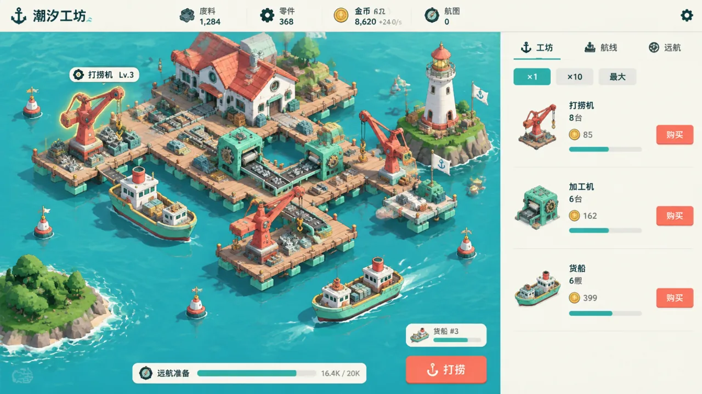

# Tidal Workshop · Visual and Asset Guidelines

## 1. Visual Goal

“A miniature workshop at sea with a visible production chain.” Bright, calm, and alive with machinery. The opening view should clearly show the harbor, crane, workbench, and cargo boats; coins and progress are their results. Avoid a realistic industrial park or a dashboard consisting only of numbers.

Generated prototypes and source sheets guide the visual direction; they are not runtime screenshots. The playable game uses assets in `public/art/` and `src/assets/ui/` that have been cropped, given transparency, normalized, and inspected in the game. Current integration records appear in Section 12.

## 2. Consistent Style

| Element | Guideline |
| --- | --- |
| View | Fixed orthographic isometric view, horizontal axes around 30°, camera elevation around 35°; consistent throughout the set |
| Forms | Clear large shapes, rounded machine housings, restrained seams and rivets; avoid photographic noise |
| Light | Upper-left daylight, short soft shadows toward the lower right; no strong depth of field or vignette |
| Surfaces | Generated matte metal, pale timber, fabric sails, and translucent turquoise shallows, retaining refined texture and bevels |
| Silhouettes | Separate forms through value, light/dark edges, and color blocks rather than heavy black outlines |
| Composition | The harbor remains fully identifiable with room for the HUD; do not crop essential machines or boats |
| Motion | Gentle floating-platform bobbing, slow ripples, rotating wheels, and traceable shipping routes |

## 3. Colors and Typography

| Token | Color | Use |
| --- | --- | --- |
| sea | #58BBC3 | Mid-value turquoise water |
| sea-deep | #278D9B | Channels and water detail; not large dark UI surfaces |
| mint | #91D9BF | Floats and automatic-machine accents |
| coral | #EE7667 | Crane arms, roofs, and the primary action |
| paper | #F5F8F3 | Sails, management surfaces, and main text backgrounds |
| ink | #263A3B | Text and clear mechanical structure |
| brass | #E7BC5A | Coins, lanterns, and completion rewards |
| timber | #BBA486 | Small amounts of wooden jetty; not the dominant page color |

The current player interface is English. Management and dialog headings use serif type; body text uses sans serif; numbers use stable tabular digits. Chinese lettering in the original prototypes is historical placeholder content. Final text, numbers, tooltips, and accessible labels are laid out in the DOM. UI font size is independent of harbor scaling. Mobile hides secondary resource labels and shortens navigation to make room.

## 4. Prototype Requirements

### Desktop Prototype

- 16:9 image showing an in-game composition, without a browser, laptop, or marketing-poster background.
- Compact top resource bar; main harbor scene on the left/center; pale paper management sidebar occupying about 25% of the width on the right.
- Lighthouse Harbor state: 1,284 scrap, 368 parts, 8,620 coins, +24.0/s sales rate, and 0 charts.
- Three workshop purchase rows: 8 salvagers, 6 presses, and 6 cargo ships, with reference next-unit prices of 85, 162, and 399.
- Bottom goal: “Prepare to sail 16.4K / 20K,” without lengthy gameplay explanations.
- The harbor reflects its stage with a lighthouse, several machines, and multiple ships. Pooled visuals may represent machine counts; every unit need not be drawn separately.

### Mobile Prototype

- 9:16 full-screen game image, without a device frame.
- Same harbor style and economic snapshot as desktop.
- Two-row resources at the top, harbor in the upper middle, compact goal strip, one column of management entries below, and three bottom tabs.
- A large salvage action sits within thumb reach without covering resources, machines, or tabs.
- Chinese lettering in the original generated image serves only as a visual placeholder; the final implementation uses DOM typography.

## 5. Asset Inventory

| Canvas node | Deliverable | Purpose | Status |
| --- | --- | --- | --- |
| tidal-desktop | Landscape UI prototype | Establish the scene/sidebar relationship and HUD hierarchy | Generated and visually inspected |
| tidal-mobile | Portrait UI prototype | Establish touch layout, scrolling regions, and tabs | Generated and visually inspected |
| tidal-harbor | Harbor environment without UI | Guide water, islands, and the static base layer | Generated with central negative space; no dynamic machines |
| tidal-buildings | Six-cell building redraw sheet | Floating dock, crane, press, warehouse, lighthouse, beacon | Native-alpha sprites cropped and integrated; white walls and lighthouse tip intact |
| tidal-fleet | Six-cell fleet and object redraw sheet | Empty boat, loaded boat, transport barge, scrap pile, parts crate, barrel-shaped navigation buoy | Native-alpha sprites cropped and integrated; cabin roofs, rails, and ivory buoy stripe intact |
| tidal-starter | Six-cell starter-facility redraw sheet | Manual hoist, workbench, office, jetty, crates, flag | Integrated; office right wall repaired, ropes and complete foundations preserved |
| tidal-icons | Twelve-cell economy/UI icon sheet | Scrap, parts, coins, charts, and action icons | Cropped; ship and lighthouse icons now derive from complete transparent redraws |
| tidal-hud-skin | Four generated HUD material images | Paper/metal frame, resource plate, mint button, coral button | Cropped and integrated; panels/resource bar use nine-slice scaling, with DOM text and controls |

Each image node saves an independent generation prompt. Later images reference the desktop prototype to constrain palette and object identity. A reference line does not prove that a model can preserve an object perfectly.

## 6. Scene Layers

1. Water base: turquoise shallows, fine ripples, distant low islands, and open channels.
2. Static docks: floats and timber platforms, replaceable as the harbor expands.
3. Buildings: independent cranes, presses, warehouse, and lighthouse, with occlusion sorted by y coordinate.
4. Boats: independent sprites moving along fixed routes; occlusion and collision do not depend on the background image.
5. Effects: production smoke, beacon light, ripples, and gain labels.
6. DOM UI: resources, management lists, goals, tabs, and confirmation dialogs.

The harbor background needs ample clear water in the center, with islands and shallow reefs at the margins. A background already filled with machines cannot replace layered composition.

## 7. Asset Production Requirements

- Buildings and starter facilities: 3 columns × 2 rows, consistent camera, lighting, and contact baseline. Complete subjects, generous gutters, no text, and no overlap.
- Fleet and objects: 3 columns × 2 rows. Boats point toward the lower right. Empty and loaded versions share the same hull identity and dimensions; only cargo changes.
- Icons: 4 columns × 3 rows, frontal with slight depth, independent silhouettes, consistent light.
- Buildings, cabins, white rails, and the buoy's ivory stripe must remain opaque. Prefer native alpha; if unavailable, use a magenta chroma-key background. Structural sheets must not use white-background removal. Legacy icons retain their original processing, while white-cabin boat and lighthouse icons derive from new transparent objects.
- Suggested processed sprite sizes: buildings 256–512 pixels, boats 128–256 pixels, resource icons 64–96 pixels. These are processing targets, not guarantees of generation resolution.
- Building anchors are bottom-center, boat anchors at hull center, and icon anchors at geometric center.
- Settings, saves, close, back, and other generic UI actions use Lucide icons and tooltips in the final game. Generated generic action icons serve only as style references.
- Initial animation favors code-driven crane swaying, gear rotation, and boat movement. Do not treat a single source image as an animation sequence.

## 8. States and Readability

- Automatic salvager: coral crane arm, mint base, visible hook.
- Press: teal body, brass gear, red pressure lever, visible output slot.
- Warehouse: white walls, red roof, green floats; clearly distinct from the press.
- Lighthouse: slender ivory tower, coral cap, brass lantern room; lighting it is a milestone.
- Basic cargo boat: green hull, ivory cabin roof, small coral funnel; loaded state adds parts crates without changing the boat.
- Resource icons: scrap uses simple metal fragments and short pipes; parts use gears and bolts; coins are brass; charts are white folded maps with a route.
- Motion and small state markers communicate production status. Do not bake ambiguous text into sprites.

## 9. Inspection Gates

After generation, open the actual images and check theme consistency, complete subjects, requested cell counts and objects, agreement between landscape and portrait information, and recognizable icon silhouettes.

Every replacement also needs checks for transparent edges, actual row/column gutters, normalized dimensions, anchors, small-size readability, and occlusion/motion in desktop and mobile gameplay. Canvas validation proves file and reference integrity; runtime screenshots and real-input checks are recorded separately.

## 10. Delivery Record

- The initial design delivered two documents, one core-loop summary, and six target images on the “Tidal Workshop · Design and Art” board. The game design document is selected as the main document.
- All six actual images were opened to inspect subjects, layouts, cell counts, and colors. File dimensions were read to verify aspect ratios. This inspection did not include runtime gameplay testing.
- The first desktop node lacked an explicit model and received the editor's default square settings. It was corrected and regenerated. The obsolete 1024×1024 draft and its local generation record were removed during example cleanup; the corrected landscape prototype remains the implementation reference.
- Canvas assets constrain the implementation. The scene and income feedback are integrated into the playable game.

### Presentation Rules for the Playable Expansion

- Keep HUD resource icons and short numbers. Do not add persistent research/expedition dashboards. Research manuscripts appear only in expedition and permanent-knowledge pages.
- Show machine upgrades through tiers and brass markers in existing machine rows. Specialization uses a five-icon choice in the workshop, acknowledged by a brief harbor marker.
- Island expeditions use an independent transport barge on an outer route. Four islands unfold by progress on the fleet page; each island's detail contains its first-discovery story.
- Every actual automatic gain uses a resource icon and fixed-screen-size label, with resource flights toward the top bar. Merge automatic gains of the same type to avoid excessive text when the fleet returns together.
- Tidal surge briefly outlines facility bases with brass diamonds; the main action shows charge state. Celebration strips disappear quickly without full-screen white flashes.
- Gain labels use 23px on desktop and mobile. Draw effects in screen coordinates so they do not scale with the harbor. Avoid baking full-page UI text into assets.
- Reduced motion retains gain and reward text while removing particles, flights, and decorative swaying. All new touch targets are at least 44px.
- Prototypes remain art references. The updated main design document and actual game define functions and values.

| Image | Actual dimensions | Visual findings and remaining work |
| --- | --- | --- |
| Landscape prototype | 2048×1152, 16:9 | Clear harbor and continuous management panel; a few extra generated characters in the top bar. Scene Lv.3 was added by the generator and is not used in the final game |
| Portrait prototype | 1152×2048, 9:16 | Complete harbor, upgrades, salvage action, and bottom tabs. +24.0/s appears twice; the final game keeps one income reading. Specific touch dimensions had not been device-tested at this stage |
| Harbor background | 2048×1152, 16:9 | Clear central water and edge islands, with no machines, boats, or UI; suitable for layered composition |
| Original building sheet | 2016×1344, 3:2 | Six clear buildings without overlap; crane and press identities match the prototype. White matte and contact shadows require processing |
| Original fleet/object sheet | 2016×1344, 3:2 | Six complete objects with similar empty/loaded boats; pixel-level hull and anchor consistency must be checked after cropping |
| Icon sheet | 2048×2048, 1:1 | Twelve recognizable icons. Scrap looks like relatively complete pipework; add a fragmented feel during small-size cleanup. Do not claim a completed 48-pixel inspection |

These images establish art direction and interface structure. The main document defines the rules. Generated labels, extra decoration, and progress bars do not introduce new mechanics.

## 11. Retained Design and Runtime References

This standalone example retains a compressed landscape concept. Its baked
lettering and numbers are historical layout references, not current UI or rules.

The harbor background and representative finished assets are shared with the
game, rather than copied into separate contact sheets:

- [Harbor background](../../public/art/sea.webp)
- [Salvage crane](../../public/art/crane.webp)
- [Assembly press](../../public/art/press.webp)
- [Empty courier](../../public/art/boat-empty.webp)
- [Loaded courier](../../public/art/boat-loaded.webp)
- [HUD frame](../../src/assets/ui/paper-frame.webp)
- [Resource plate](../../src/assets/ui/resource-plate.webp)

## 12. Runtime Asset Contract

The game includes 28 transparent WebP sprites and one harbor background.
Building and boat canvases are 512×512; icons are 160×160. Five HUD materials
live in `src/assets/ui/` and are bundled by Vite. Runtime files retain their
original bytes, dimensions and transparency.

Structural artwork preserves opaque ivory walls, cabin roofs, rails and buoy
stripes. Do not remove white pixels as if they were background. The historical
crop and anchor records remain in `assets/manifests/`; source provenance names
original workspace paths and explicitly marks them as excluded from the example.
The original workspace retains the source sheets and processing scripts.

The compact Canvas keeps the two documents, loop summary, concept, background
and representative runtime assets, preserving retained IDs. Historical generated
sheets, contact previews, generation jobs and stale layout references are omitted.
No asset-preparation or ZIP-export command is needed to use this example.

## 13. Earlier Verification and Current Scope

Earlier implementation checks covered opaque building walls, boat cabins,
management input blocking, keyboard dialog scrolling, automatic resource
feedback, English UI, progression and production builds. These are historical
records rather than a fresh verification of every mechanic. Current commands
and licensing are documented in the root README and credits. First-voyage
pacing and independent listening tests still need human review.
